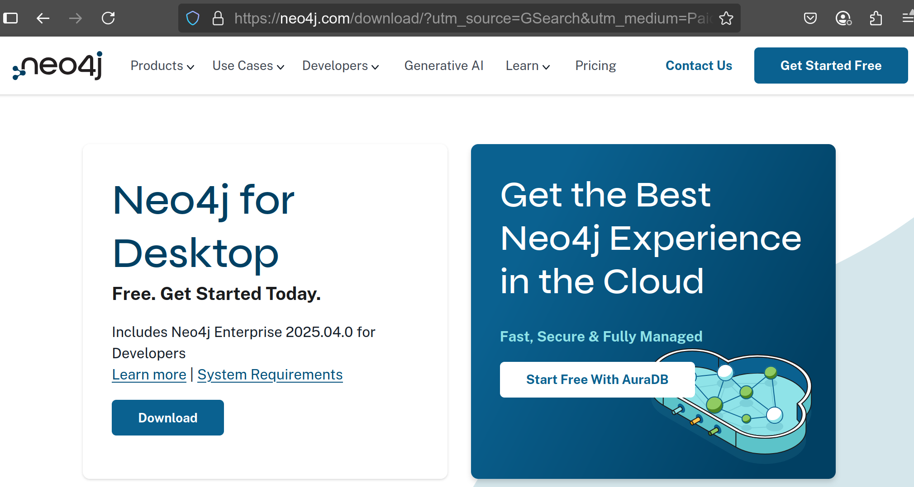

# How-to guide to install Neo4j Desktop

**Objective**: To install Neo4j Desktop in the context of BioCypher usage.

1. Search on your favorite search engine the phrase "Neo4j Desktop Download". 

2. By the time of writing this guide, you will have a view like this one: 

3. Click on download and fill out the data requested.

4. 