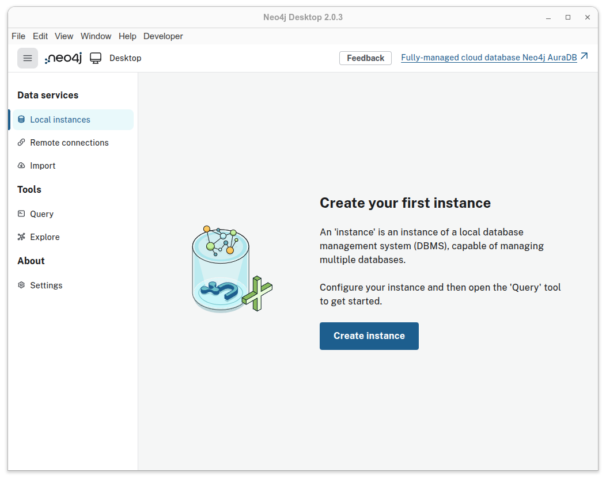
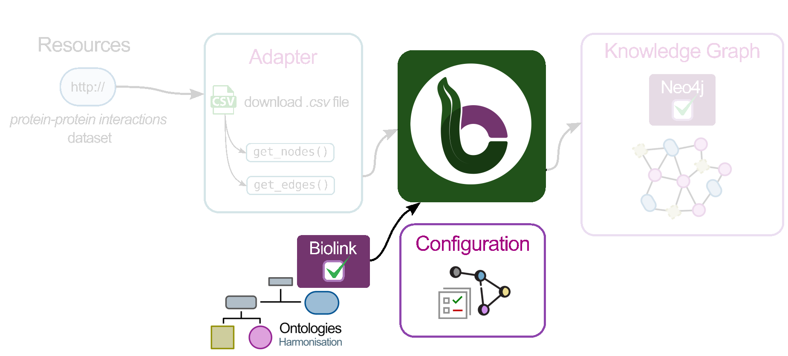
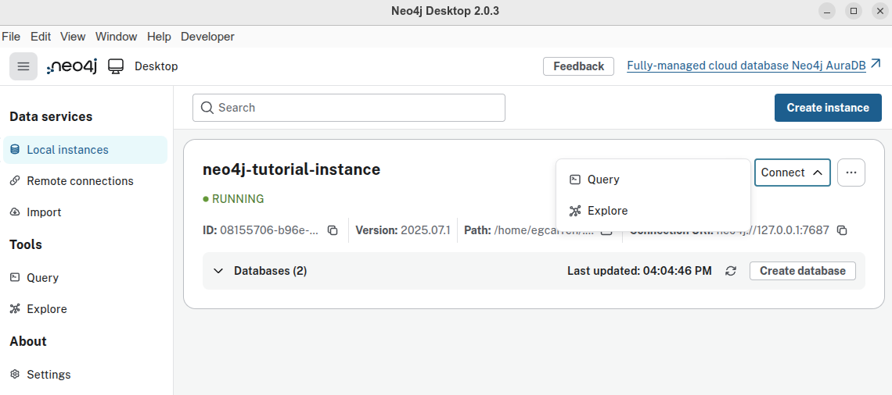

# Hands-On Protein Graphs with BioCypher and Neo4j

## Table of Contents

- [Overview](#overview)
- [Pre-requisites](#pre-requisites)
- [Setup](#setup)
- [Section 1. Exploratory Data Analysis](#section-1-exploratory-data-analysis)
- [Section 2. Graph Modeling](#section-2-graph-modeling)
- [Section 3. Graph creation with BioCypher](#section-3-graph-creation-with-biocypher)
- [Section 4. Interacting with your graph using Neo4j](#section-4-interacting-with-your-graph-using-neo4j)

## Overview

This tutorial will help you get started with BioCypher. You will learn how to create a simple knowledge graph with a synthetic dataset that contains information about proteins and its interactions.

By the end of this tutorial, you will be able to:

- Set up BioCypher for a basic project.
- Explore a synthetic dataset and how to obtain a graph model from it.
- Build a small knowledge graph from the data.
- View and query the graph using Neo4j.


## Pre-requisites

> **Note:** Ensure you have the following prerequisites before continue with the tutorial.

| Tool   | Version/Requirement | Installation Link                                  | Notes                     |
| ------ | ------------------- | -------------------------------------------------- | ------------------------- |
| Git    | Any                 | [Git Docs](https://git-scm.com/downloads)          | For version control       |
| Neo4j  | >=1.6               | [Neo4j Desktop](https://neo4j.com/download/)       | For querying graphs       |
| Poetry | 1.8.x               | [Poetry Docs](https://python-poetry.org/docs/1.8/) | For dependency management |
| Python | >= 3.10             | [Python.org](https://www.python.org/downloads/)    | Required for BioCypher    |


## Setup

### Setup Python project

In this section, you will set up your working environment using the BioCypher Project Template. This template provides a ready-to-use folder structure and example files, so you can focus on building your application.

**Steps:**

1. Clone the [BioCypher Project Template](https://github.com/biocypher/project-template) and rename the folder as `tutorial-basics-biocypher`:
    ```bash
    git clone https://github.com/biocypher/project-template.git
    mv project-template tutorial-basics-biocypher
    cd tutorial-basics-biocypher
    ```

2. Initialize your own Git repository:
    ```bash
    rm -rf .git
    git init
    git checkout -b main
    git add .
    git commit -m "Initial commit"
    ```

3. Check the current project structure. Below, we list the most important folders and files for this tutorial.

    ```
    /tutorial-basics-biocypher
        ├── config 
        │   ├── biocypher_config.yaml 
        │   ├── biocypher_docker_config.yaml
        │   └── schema_config.yaml
        ├── create_knowledge_graph.py 
        ├── pyproject.toml
        ├── template_package
        │   └── adapters
        │       └── example_adapter.py
        ...
    ```


4. Install the dependencies using your preferred tool (Poetry, pip, or conda):

**Using Poetry:**
```bash
poetry install --no-root
```

**Using pip:**
```bash
python -m venv .venv
source .venv/bin/activate
pip install biocypher==0.10.1
```

**Using conda:**
```bash
conda create -n myenv python=3.10
conda activate myenv
pip install biocypher==0.10.1
```

> *Note: If you use pip or conda, manually install each dependency listed in `pyproject.toml`.*

### Setup Neo4j

In this section, we will create a Neo4j instance to use later in the tutorial. It is important to set this up now.

a. Execute Neo4j Desktop, if this the first time you should see a window like this one.
<div align="center">
  
  <br>
  <em>Figure 1. Neo4j Desktop start screen.</em>
</div>

b. Create a new instance in Neo4j. For this tutorial, name it `neo4j-tutorial-instance` and choose a password you can remember.

<div align="center">
  
  <br>
  <em>Figure 2. Create Instance window. This may vary depending on your Neo4j version.</em>
</div>

c. Check the details of your Neo4j instance. It is important to know the exact location, as we will use this path throughout the tutorial.

<div align="center">
  
  <br>
  <em>Figure 3. Neo4j instance with its path location highlighted.</em>
</div>


## Section 1. Exploratory Data Analysis

For this tutorial we are going to use a [synthetic dataset](https://zenodo.org/records/16745602) that contains information about the interaction between proteins. 

- First, download the dataset:

    ```bash
    mkdir -p ./data/in/
    curl -o ./data/in/synthetic_protein_interactions.tsv \
    https://zenodo.org/records/16745602/files/synthetic_protein_interactions.tsv
    ```

- Create a folder called `notebooks` under `tutorial-basics-biocypher`
    ```bash
    mkdir -p ./notebooks/
    ```
- Create and run either a Python file or a Jupyter notebook (if Jupyter is installed in your environment) containing the following code. 
    **File: `notebooks/eda_synthetic_data.py`**
    ```python
    import pandas as pd

    # Load the dataset
    df = pd.read_csv('../data/in/synthetic_protein_interactions.tsv', sep='\t')

    # Show the first few rows
    print("\n---- First 10 rows in the dataset")
    print(df.head(10))

    # List the columns in the dataset
    print("\n---- Columns in the dataset")
    for column in df.columns:
        print(f"\t{column}")

    # Get basic info about the datasets
    print("\n---- Summary Dataframe")
    print(df.info())

    # Check for missing values
    print("\n---- Check missing values")
    print(df.isnull().sum())

    # Show summary statistics for numeric columns
    print("\n---- Describe Dataframe statistics")
    print(df.describe())

    # Show unique protein names
    print("\n---- Number of unique proteins per column.")
    print('Unique proteins in column protein_a:', df['source'].nunique())
    print('Unique proteins in column protein_b:', df['target'].nunique())
    
    ```
    
> 📝 **Exercise:** 
> a. How many unique proteins do we have in the dataset?
> b. How many interactions exist in our dataset?
> c. Some columns contain boolean values represented as 1s and 0s. Can you detect which ones?

> ✅ **Answer:** 
> a. Number of unique proteins: 15.
> b. Number of unique interactions: 22.
> c. `is_directed`, `is_stimulation`, `is_inhibition`, `consensus_direction`, `consensus_stimulation`,`consensus_inhibition`.


## Section 2. Graph Modeling
### Graph Modeling

By looking at the CSV file, we can see that there are two columns called `source` and `target`, which represent proteins. This means that each row represents an interaction between a source protein and a target protein. For now, our graph could look like this.

<div align="center">
  
  <br>
  <em>Figure 4. Simple graph model for representing interactions between proteins</em>
</div>
<br>

Can we improve the graph? Absolutely! Understanding the data is essential for building an effective graph. By examining the other columns in the table, we can identify additional details:

- The `source` and `target` columns represent **nodes** in the graph, with each node corresponding to a protein.

- Each protein listed in the `source` column has associated properties found in other columns:
  - `source_genesymbol`: the gene symbol of the source protein.
  - `ncbi_tax_id_source`: the NCBI taxonomy identifier of the source protein.
  - `entity_type_source`: the type of entity for the source protein.

- Each protein in the `target` column has associated properties found in other columns:
  - `target_genesymbol`
  - `ncbi_tax_id_target`
  - `entity_type_target`

<div align="center">
  
    <br>
  <em>Figure 5. Simple protein interaction graph with properties in nodes</em>
</div>
<br>

We know that a `source` protein interacts with a `target` protein, but do we know **how**?

Remaining columns in the table describe properties of these protein-protein interactions:

**Interaction properties**
- `is_directed`
- `is_stimulation`
- `is_inhibition`
- `consensus direction`
- `consensus inhibition`
- `type`

We are ready to model our second version of our graph. It is like follows:

<div align="center">
  
    <br>
  <em>Figure 6. Protein interaction graph showing node and edge properties</em>
</div>
<br>

Finally, we can create a more detailed graph using our dataset. Rather than representing all interactions in a generic way, we can use the `type` field to show the specific type of interaction occurring between each pair of proteins.

<div align="center">
  
      <br>
  <em>Figure 7. Graph model for representing different interactions between proteins</em>
</div>

### Exercise 1. Example of a graph we expect with our data

> 📝 **Exercise:** 
> Sketch a portion of the knowledge graph using the provided dataset.

> ✅ **Answer:** 
> If you include all the nodes and edges from your CSV file, your sketch should look like the following example:


## Section 3. Graph creation with BioCypher

We aim to create a knowledge graph using the data we found in the CSV file. Let's recap our exercise:

- Create a **graph** with the following characteristics:
  - One node type: `Protein`.
  - Five edge types: `activation`, `binding`, `inhibition`, `phosphorylation`, `ubiquitination`.
- Each **node** has properties:
  - *genesymbol*
  - *ncbi_tax_id*
  - *entity_type*
  
- Each **edge** has properties:
  - *is_directed*
  - *is_stimulation*
  - *is_inhibition*
  - *consensus_direction*
  - *consensus_inhibition*

- We must export the knowledge graph to Neo4j.

To achieve this, ee can divide the process into three sections:
1. Configuration.
    - Schema configuration
    - BioCypher configuration 

2. Adapter creation.
     - Read/connect to input data
     - Process data
     - Stream processed data

3. Knowledge Graph script


### Step 1. Configuration

<div align="center">
  
</div>

#### Create a schema for your graph

**Rationale:** the schema file allows us to define the skeleton for our knowledge graph. Nodes, edges, properties are defined here.

The following is an example of how our schema file should look like, all of this is based on how we defined the graph structure (nodes, edges and their properties). 

**File: `config/schema_config.yaml`**
```yaml
#-------------------------------------------------------------------
#-------------------------      NODES      -------------------------
#-------------------------------------------------------------------
#=========    PARENT NODES
protein:
    represented_as: node
    preferred_id: uniprot
    input_label: uniprot_protein

#-------------------------------------------------------------------
#------------------      RELATIONSHIPS (EDGES)     -----------------
#-------------------------------------------------------------------
#=========    PARENT EDGES
protein protein interaction:
    is_a: pairwise molecular interaction
    represented_as: edge
    input_label: protein_protein_interaction
    properties:
        is_stimulation: bool
        is_inhibition: bool
        consensus_direction: bool
        consensus_stimulation: bool
        
#=========    INHERITED EDGES
binding:
    is_a: protein protein interaction
    inherit_properties: true
    represented_as: edge
    input_label: binding

# ...rest of schema_config.yaml omitted for brevity...
```

##### Nodes

The `protein` top-level key in the YAML snippet identifies our entity and connects it to the ontological backbone.

| Key              | Value             | Description                                                                                                                                               |
| ---------------- | ----------------- | --------------------------------------------------------------------------------------------------------------------------------------------------------- |
| `represented_as` | `node`            | Specifies how BioCypher should represent each entity in the graph; in this case, as a node.                                                               |
| `preferred_id`   | `uniprot`         | Defines a namespace for our proteins. In this example, all proteins follow the UniProt convention—a 5-character alphanumeric string (e.g., P00533).       |
| `input_label`    | `uniprot_protein` | Indicates the expected label in the node tuple. All other input nodes without this label are ignored unless they are defined in the schema configuration. |

For more information about which other keywords you can use to configure your nodes in the schema file consult [Fields reference](https://biocypher.org/BioCypher/reference/schema-config/#fields-reference).

TODO: [Edwin] explain a little bit about how to express the ontological backbone Biolink model


##### Edges (relationships)

As shown in [Figure 7](#graph-modeling), each edge has the same set of properties (`is_directed`, `is_consensus`, etc.). At this stage, we have two options for defining the edges:

- Option 1: Create each edge and explicitly define the same set of property fields for every edge.

**File: `config/schema_config.yaml`**
```yaml
#-------------------------------------------------------------------
#------------------      RELATIONSHIPS (EDGES)     -----------------
#-------------------------------------------------------------------
activation:
    is_a: pairwise molecular interaction
    represented_as: edge
    input_label: protein_protein_interaction
    properties:
        is_stimulation: bool
        is_inhibition: bool
        consensus_direction: bool
        consensus_stimulation: bool

binding:
    is_a: pairwise molecular interaction
    represented_as: edge
    input_label: protein_protein_interaction
    properties:
        is_stimulation: bool
        is_inhibition: bool
        consensus_direction: bool
        consensus_stimulation: bool

# ...rest of schema_config.yaml omitted for brevity...
```

- Option 2: Create a base edge with the properties, and then create edges that inherit the behavior of this base edge. This approach reduces lines of code and avoids repetition. For example, if you have more than 20 edges, Option 1 would likely not be practical.

**File: `config/schema_config.yaml`**
```yaml
#-------------------------------------------------------------------
#------------------      RELATIONSHIPS (EDGES)     -----------------
#-------------------------------------------------------------------
#====   BASE EDGE or PARENT EDGE
protein protein interaction:
    is_a: pairwise molecular interaction
    represented_as: edge
    input_label: protein_protein_interaction
    properties:
        is_stimulation: bool
        is_inhibition: bool
        consensus_direction: bool
        consensus_stimulation: bool
        
#====   INHERITED EDGES
activation:
    is_a: protein protein interaction
    inherit_properties: true
    represented_as: edge
    input_label: activation

binding:
    is_a: protein protein interaction
    inherit_properties: true
    represented_as: edge
    input_label: binding

# ...rest of schema_config.yaml omitted for brevity...
```

Let's explain the keys and values for the second case (Option 2), because we are going to use the second option approach.

**Base Edge**
The `protein protein interaction` top-level key in the YAML snippet identifies our edge entity.

| Key              | Value                                             | Description                                                                                             |
| ---------------- | ------------------------------------------------- | ------------------------------------------------------------------------------------------------------- |
| `is_a`           | `pairwise molecular interaction`                  | Defines the type of entity based on the ontology.                                                       |
| `represented_as` | `edge`                                            | Explicitly specifies that this entity is an edge.                                                       |
| `input_label`    | `protein_protein_interaction`                     | Defines a namespace for our relationships.                                                              |
| `properties`     | *property*: *datatype* (i.e. `is_directed: bool`) | Contains all properties associated with this edge; each property has a name and an associated datatype. |


**Inherited Edges**
The `activation:` top-level key in the YAML snippet identifies our edge entity.

| Key                  | Value                         | Description                                                                                           |
| -------------------- | ----------------------------- | ----------------------------------------------------------------------------------------------------- |
| `is_a`               | `protein protein interaction` | Defines the type of entity; in this case, it is a child of the base edge we defined previously.       |
| `inherit_properties` | `true`                        | Indicates whether all properties defined in the base edge should be inherited.                        |
| `represented_as`     | `edge`                        | Specifies that BioCypher will treat this entity (`activation`) as an edge.                            |
| `input_label`        | `binding`                     | Specifies the expected edge label; edges without this label are ignored unless defined in the schema. |


> 📝 **Exercise:** 
> Revise and complete the `schema_config.yaml` file, and make sure it is located in the `config` folder.

> ✅ **Answer:** 
> See the example below for a completed `schema_config.yaml`.

**File: `config/schema_config.yaml`**
```yaml
#-------------------------------------------------------------------
#-------------------------      NODES      -------------------------
#-------------------------------------------------------------------
#====   PARENT NODES
protein:
    represented_as: node
    preferred_id: uniprot
    input_label: uniprot_protein

#-------------------------------------------------------------------
#------------------      RELATIONSHIPS (EDGES)     -----------------
#-------------------------------------------------------------------
#====   PARENT EDGES
protein protein interaction:
    is_a: pairwise molecular interaction
    represented_as: edge
    input_label: protein_protein_interaction
    properties:
        is_stimulation: bool
        is_inhibition: bool
        consensus_direction: bool
        consensus_stimulation: boo
        
#====   INHERITED EDGES
activation:
    is_a: protein protein interaction
    inherit_properties: true
    represented_as: edge
    input_label: activation

binding:
    is_a: protein protein interaction
    inherit_properties: true
    represented_as: edge
    input_label: binding

inhibition:
    is_a: protein protein interaction
    inherit_properties: true
    represented_as: edge
    input_label: inhibition

phosphorylation:
    is_a: protein protein interaction
    inherit_properties: true
    represented_as: edge
    input_label: phosphorylation

ubiquitination:
    is_a: protein protein interaction
    inherit_properties: true
    represented_as: edge
    input_label: ubiquitination

```

#### Configure BioCypher behavior

**Rationale:** The purpose of writing a `biocypher_config.yaml` is to define how BioCypher should operate for your project—specifying settings for data import, graph creation, and database interaction—all in one place for clarity and easy customization.

**File: `config/biocypher_config.yaml`**
```yaml
#---------------------------------------------------------------
#--------        BIOCYPHER GENERAL CONFIGURATION        --------
#---------------------------------------------------------------
biocypher:
  offline: true
  debug: false
  schema_config_path: config/schema_config.yaml
  cache_directory: .cache

#----------------------------------------------------
#--------        OUTPUT CONFIGURATION        --------
#----------------------------------------------------
neo4j:
  database_name: neo4j-tutorial-database
  delimiter: '\t'
  array_delimiter: '|'
  skip_duplicate_nodes: true
  skip_bad_relationships: true
  import_call_bin_prefix: <path to your Neo4j instance>/bin/
```

The first block is the BioCypher Core Settings, which starts with `biocypher:`

| key                  | value                       | description                                                          |
| -------------------- | --------------------------- | -------------------------------------------------------------------- |
| `offline`            | `true`                      | Whether to run in offline mode (no running DBMS or in-memory object) |
| `debug`              | `false`                     | Whether to enable debug logging                                      |
| `schema_config_path` | `config/schema_config.yaml` | Path to the schema configuration file                                |
| `cache_directory`    | `.cache`                    | Path to the schema configuration file                                |


The second block is the Database Management System Settings, which starts with the name of the DBMS, in this case it's `neo4j:`

| key                      | value             | description                                          |
| ------------------------ | ----------------- | ---------------------------------------------------- |
| `delimiter`              | `'\t'`            | Field delimiter for CSV import files                 |
| `array_delimiter`        | `';'`             | Delimiter for array values                           |
| `skip_duplicate_nodes`   | `true`            | Whether to skip duplicate nodes during import        |
| `skip_bad_relationships` | `true`            | Whether to skip relationships with missing endpoints |
| `import_call_bin_prefix` | i.e., `/usr/bin/` | Prefix for the import command binary (optional)      |


The default configuration that comes with BioCypher and more configuration parameters for the Settings are listed in [BioCypher Configuration Reference](https://biocypher.org/BioCypher/reference/biocypher-config/).

> 📝 **Exercise:** 
> Revise and complete the `biocypher_config.yaml` file, and make sure it is located in the `config` folder.

> ✅ **Answer:** 
> See the example below for a completed `biocypher_config.yaml`. Note, the path in the  `import_call_bin_prefix` correspond to my personal instance, **you MUST update this path with yours, do not forget to add /bin/** as in my example

**File: `biocypher_config.yaml`**
```yaml
#---------------------------------------------------------------
#--------        BIOCYPHER GENERAL CONFIGURATION        --------
#---------------------------------------------------------------
biocypher:
  offline: true
  debug: false
  schema_config_path: config/schema_config.yaml
  cache_directory: .cache

#----------------------------------------------------
#--------        OUTPUT CONFIGURATION        --------
#----------------------------------------------------
neo4j:
  delimiter: '\t'
  array_delimiter: '|'
  skip_duplicate_nodes: true
  skip_bad_relationships: true
  import_call_bin_prefix: /home/egcarren/.config/neo4j-desktop/Application/Data/dbmss/dbms-08155706-b96e-4e74-a965-7d6d27b78db8/bin/
```

### Step 2. Create an adapter

<div align="center">
  
</div>

**Rationale:** An adapter allows you to efficiently transform, integrate, combine data from different sources ensuring compatibility with BioCypher's schema and streamlining the import process.

a. Create a file called `adapter_synthetic_proteins.py` under the folder `/template_package/adapters/`, in this file we are going to create our adapter.

b. Write classes for the different nodes and their properties in our graph. For now, focus on analyzing the following snippet and compare it with the node elements expected in our schema file (`schema_file.yaml`).

**File: `/template_package/adapters/adapter_synthetic_proteins.py`**
```python
class AdapterNodeType(Enum):
    """
    Define types of nodes the adapter can provide.
    """

    PROTEIN = auto()

class AdapterProteinField(Enum):
    """
    Define possible fields the adapter can provide for proteins.
    """

    ID = "id"
    PREFERRED_ID = "preferred_id"
    GENE_SYMBOL = "genesymbol"
    NCBI_TAX_ID = "ncbi_tax_id"
```
c. Write classes for the different edges and their properties in our graph. For now, analyze the following snippet and compare it with the edge elements expected in our schema file (`schema_file.yaml`).

**File: `/template_package/adapters/adapter_synthetic_proteins.py`**
```python
class AdapterEdgeType(Enum):
    """
    Enum for the types of the protein adapter.
    """

    PROTEIN_PROTEIN_INTERACTION = "protein_protein_interaction"
    BINDING = "binding"
    ACTIVATION = "activation"
    PHOSPHORYLATION = "phosphorylation"
    UBIQUITINATION = "ubiquitination"
    INHIBITION = "inhibition"

class AdapterProteinProteinEdgeField(Enum):
    """
    Define possible fields the adapter can provide for protein-protein edges.
    """

    INTERACTION_TYPE = "interaction_type"
    INTERACTION_SOURCE = "interaction_source"
    IS_STIMULATION = "is_stimulation"
    IS_INHIBITION = "is_inhibition"
    CONSENSUS_DIRECTION = "consensus_direction"
    CONSENSUS_STIMULATION = "consensus_stimulation"
    CONSENSUS_INHIBITION = "consensus_inhibition"
```

Now you are ready to write functions that load the data into a dataframe and extract nodes and edges. Before doing this you need to understand that BioCypher expect a certatin format. Let's discuss this:

BioCypher expects each node or edge being a tuple (datastructure).

#### Nodes Convention
BioCypher expects each node being a **3-element tuple**, with elements in the following order:
1. [*mandatory*]  `ID`: this is a unique identifier for the node (i.e., `P53`)
2. [*mandatory*]  `LABEL`: this is a namespace for the node (i.e, `uniprot`)
3. [*optional*]   `PROPERTIES`: this is dictionary that contains properties for the node.

For example:

```python
#  ✅ This is a 3-element tuple
# 1     2          3
("P53", "uniprot", {"entity_type": "protein", "ncbi_tax_id":9096})
```

```python
# ✖️ This is NOT a 3-element tuple
#1      2          3              4          5              6  
("P53", "uniprot", "entity_type", "protein", "ncbi_tax_id", 9096)
```

#### Edges Convention
BioCypher expects each edge being a **5-element tuple**, with elements in the following order:
1. [*optional*]  `ID`: this is a unique identifier for the edge (i.e., `P53CREB1`)
2. [*mandatory*]  `SOURCE`: this is the ID for the source node (i.e, `P53`)
3. [*mandatory*]  `TARGET`: this is the ID for the source node (i.e, `CREB1`)
4. [*mandatory*]  `LABEL`: this is a namespace for the edge (i.e, `activation`, `inhibition`)
5. [*optional*] `PROPERTIES`: this is dictionary that contains properties for the edge.

```python
#  ✅ This is a 5-element tuple for BioCypher
#1   2      3        4                 5
("", "P53", "CREB1", "ubiquitination", {"is_directed": True})
```

```python
# ✖️ This is NOT the 5-element tuple format that BioCypher expects. Can you explain why?
#1           2      3                 4              5      
("P53CREB1", "P53", "ubiquitination", "is_directed", True)
```

Finally, write the functions that read the data as a DataFrame and override the functions to extract nodes and edges in the formats expected by BioCypher. This is illustrated in the next snippet.

**File: `/template_package/adapters/adapter_synthetic_proteins.py`**
```python
def _read_csv(self) -> pd.DataFrame:
    """
    Reads and validates the TSV file.
    Returns:
        pd.DataFrame: DataFrame containing the TSV data.
    Raises:
        FileNotFoundError: If the file does not exist.
        ValueError: If required columns are missing.
    """
    if not Path(self.csv_path).exists():
        logger.error(f"CSV file not found: {self.csv_path}")
        raise FileNotFoundError(f"CSV file not found: {self.csv_path}")
    df = pd.read_csv(self.csv_path, sep="\t", header=0)
    required_columns = [
        'source', 'target', 'source_genesymbol', 'target_genesymbol',
        'ncbi_tax_id_source', 'ncbi_tax_id_target', 'type',
        'is_stimulation', 'is_inhibition', 'consensus_direction',
        'consensus_stimulation', 'consensus_inhibition'
    ]
    missing = [col for col in required_columns if col not in df.columns]
    if missing:
        logger.error(f"Missing columns in CSV: {missing}")
        raise ValueError(f"CSV must contain columns: {missing}")
    return df

def get_nodes(self) -> 'Generator[tuple[str, str, dict], None, None]':
    """
    Yields node tuples for node types specified in the adapter constructor.

    Returns:
        Generator[tuple[str, str, dict], None, None]:
            Each tuple is (id, label, properties).
    """
    logger.info("Reading nodes.")
    df = self._read_csv()

    # Generator for nodes in the `source` column
    for row in df.itertuples(index=False):            
        id = row.source
        input_label = "uniprot_protein"

        properties = {
            'genesymbol': row.source_genesymbol,
            'ncbi_tax_id': row.ncbi_tax_id_source,
            'entity_type': row.entity_type_source,
        }

        yield(
            id,
            input_label,
            properties
        )

    # Generator for nodes in the `target` column
    for row in df.itertuples(index=False):            
        id = row.target
        input_label = "uniprot_protein"

        properties = {
            'genesymbol': row.target_genesymbol,
            'ncbi_tax_id': row.ncbi_tax_id_target,
            'entity_type': row.entity_type_target,
        }

        yield(
            id,
            input_label,
            properties
        )

def get_edges(self) -> 'Generator[tuple[str, str, str, str, dict], None, None]':
    """
    Yields edge tuples for edge types specified in the adapter constructor.

    Returns:
        Generator[tuple[str, str, str, str, dict], None, None]:
            Each tuple is (id, source, target, type, properties).
    """
    logger.info("Generating edges.")
    df = self._read_csv()

    for row in df.itertuples(index=False):
        # Concatenate source and target, i.e., "SOD1EGFR"
        id = f"{row.source}{row.target}"

        source = row.source
        
        target = row.target

        type = row.type

        properties = {
            'is_stimulation': row.is_stimulation,
            'is_inhibition': row.is_inhibition,
            'consensus_direction': row.consensus_direction,
            'consensus_stimulation': row.consensus_stimulation,
            'consensus_inhibition': row.consensus_inhibition
        }

        yield (
            id,
            source,
            target,
            type,
            properties
        )

```

> 📝 **Exercise:** 
> Integrate the aforementioned snippets in a single file call `adapter_synthetic_proteins.py`.

> ✅ **Answer:** 
> See the example below for a completed `adapter_synthetic_proteins.py`.

**File: `/template_package/adapters/adapter_synthetic_proteins.py`**
```python
import os
from enum import Enum, auto
from itertools import chain
from typing import Optional, Generator
from pathlib import Path


import pandas as pd
from biocypher import BioCypher
from biocypher._logger import logger


CSV_FILE_PATH_SYNTHETIC_PROTEINS = Path("./cache/synthetic_protein_interactions.tsv")

class AdapterNodeType(Enum):
    """
    Define types of nodes the adapter can provide.
    """

    PROTEIN = auto()

class AdapterProteinField(Enum):
    """
    Define possible fields the adapter can provide for proteins.
    """

    ID = "id"
    PREFERRED_ID = "preferred_id"
    GENE_SYMBOL = "genesymbol"
    NCBI_TAX_ID = "ncbi_tax_id"

class AdapterEdgeType(Enum):
    """
    Enum for the types of the protein adapter.
    """

    PROTEIN_PROTEIN_INTERACTION = "protein_protein_interaction"
    BINDING = "binding"
    ACTIVATION = "activation"
    PHOSPHORYLATION = "phosphorylation"
    UBIQUITINATION = "ubiquitination"
    INHIBITION = "inhibition"

class AdapterProteinProteinEdgeField(Enum):
    """
    Define possible fields the adapter can provide for protein-protein edges.
    """

    INTERACTION_TYPE = "interaction_type"
    INTERACTION_SOURCE = "interaction_source"
    IS_STIMULATION = "is_stimulation"
    IS_INHIBITION = "is_inhibition"
    CONSENSUS_DIRECTION = "consensus_direction"
    CONSENSUS_STIMULATION = "consensus_stimulation"
    CONSENSUS_INHIBITION = "consensus_inhibition"

class Adapter:
    def __init__(
        self,
        csv_path: str = CSV_FILE_PATH_SYNTHETIC_PROTEINS,
        node_types: Optional[list] = None,
        node_fields: Optional[list] = None,
        edge_types: Optional[list] = None,
        edge_fields: Optional[list] = None,
    ):
        self.csv_path = csv_path
        self._set_types_and_fields(node_types, node_fields, edge_types, edge_fields)

    def _read_csv(self) -> pd.DataFrame:
        """
        Reads and validates the TSV file.
        Returns:
            pd.DataFrame: DataFrame containing the TSV data.
        Raises:
            FileNotFoundError: If the file does not exist.
            ValueError: If required columns are missing.
        """
        if not Path(self.csv_path).exists():
            logger.error(f"CSV file not found: {self.csv_path}")
            raise FileNotFoundError(f"CSV file not found: {self.csv_path}")
        df = pd.read_csv(self.csv_path, sep="\t", header=0)
        required_columns = [
            'source', 'target', 'source_genesymbol', 'target_genesymbol',
            'ncbi_tax_id_source', 'ncbi_tax_id_target', 'type',
            'is_stimulation', 'is_inhibition', 'consensus_direction',
            'consensus_stimulation', 'consensus_inhibition'
        ]
        missing = [col for col in required_columns if col not in df.columns]
        if missing:
            logger.error(f"Missing columns in CSV: {missing}")
            raise ValueError(f"CSV must contain columns: {missing}")
        return df

    def get_nodes(self) -> 'Generator[tuple[str, str, dict], None, None]':
        """
        Yields node tuples for node types specified in the adapter constructor.

        Returns:
            Generator[tuple[str, str, dict], None, None]:
                Each tuple is (id, label, properties).
        """
        logger.info("Reading nodes.")
        df = self._read_csv()

        # Generator for nodes in the `source` column
        for row in df.itertuples(index=False):            
            id = row.source
            input_label = "uniprot_protein"

            properties = {
                'genesymbol': row.source_genesymbol,
                'ncbi_tax_id': row.ncbi_tax_id_source,
                'entity_type': row.entity_type_source,
            }

            yield(
                id,
                input_label,
                properties
            )

        # Generator for nodes in the `target` column
        for row in df.itertuples(index=False):            
            id = row.target
            input_label = "uniprot_protein"

            properties = {
                'genesymbol': row.target_genesymbol,
                'ncbi_tax_id': row.ncbi_tax_id_target,
                'entity_type': row.entity_type_target,
            }

            yield(
                id,
                input_label,
                properties
            )

    def get_edges(self) -> 'Generator[tuple[str, str, str, str, dict], None, None]':
        """
        Yields edge tuples for edge types specified in the adapter constructor.

        Returns:
            Generator[tuple[str, str, str, str, dict], None, None]:
                Each tuple is (id, source, target, type, properties).
        """
        logger.info("Generating edges.")
        df = self._read_csv()

        for row in df.itertuples(index=False):
            # Concatenate source and target, i.e., "SOD1EGFR"
            id = f"{row.source}{row.target}"

            source = row.source
            
            target = row.target

            type = row.type

            properties = {
                'is_stimulation': row.is_stimulation,
                'is_inhibition': row.is_inhibition,
                'consensus_direction': row.consensus_direction,
                'consensus_stimulation': row.consensus_stimulation,
                'consensus_inhibition': row.consensus_inhibition
            }

            yield (
                id,
                source,
                target,
                type,
                properties
            )

    def get_node_count(self) -> int:
        """
        Returns the number of nodes generated by the adapter.

        Returns:
            int: Number of nodes generated.
        """
        return sum(1 for _ in self.get_nodes())

    def _set_types_and_fields(self, node_types, node_fields, edge_types, edge_fields) -> None:
        """
        Sets the node and edge types and fields for the adapter.

        Args:
            node_types (Optional[list]): List of node types.
            node_fields (Optional[list]): List of node fields.
            edge_types (Optional[list]): List of edge types.
            edge_fields (Optional[list]): List of edge fields.
        """
        if node_types:
            self.node_types = node_types
        else:
            self.node_types = [type for type in AdapterNodeType]

        if node_fields:
            self.node_fields = node_fields
        else:
            self.node_fields = [
                field
                for field in chain(
                    AdapterProteinField,
                )
            ]

        if edge_types:
            self.edge_types = edge_types
        else:
            self.edge_types = [type for type in AdapterEdgeType]

        if edge_fields:
            self.edge_fields = edge_fields
        else:
            self.edge_fields = [field for field in chain()]
```


### Step 3. Create a knowledge graph script

<div align="center">
  
</div>

**Rationale:** Integrating all steps—downloading the dataset, loading the data, extracting nodes and edges, and exporting graph assets—into a single script streamlines the entire process. This approach makes it easier to build and manage the knowledge graph pipeline efficiently and reproducibly.

1. Create a BioCypher object

    **File: `create_knowledge_graph.py`**
    ```python
    from biocypher import BioCypher, FileDownload

    # Create an instance of BioCypher
    bc = BioCypher()
    ```

2.  Use BioCypher to automatically download the file with cache capabilities.

    **File: `create_knowledge_graph.py`**
    ```python
    # Download the file with cache capabilities
    url_dataset = (
        "https://zenodo.org/records/16745602/files/synthetic_protein_interactions.tsv"
    )

    resource = FileDownload(
        name="protein-protein-interaction-dataset",  # Name of the resource
        url_s=url_dataset,  # URL to the resource(s)
        lifetime=7,  # seven days cache lifetime
    )
    paths = bc.download(resource)  # Downloads to '.cache' by default

    print(f"Path to the resouce: {paths}")
    ```


3. Instantiate your adapter from the classes you created previously in your adapter file.

    **File: `create_knowledge_graph.py`**
    ```python

    from template_package.adapters.adapter_synthetic_proteins import (
        AdapterNodeType,
        AdapterProteinField,
        AdapterEdgeType,
        Adapter,
    )

    # Choose the node type you want appear in the Knowledge Graph
    node_types = [
        AdapterNodeType.PROTEIN
    ]

    # Choose protein adapter fields to include in the knowledge graph.
    node_fields = [
        AdapterProteinField.ID,
        AdapterProteinField.PREFERRED_ID,
        AdapterProteinField.GENE_SYMBOL,
        AdapterProteinField.NCBI_TAX_ID
    ]

    # Choose the node type you want appear in the Knowledge Graph
    edge_types = [
        AdapterEdgeType.PROTEIN_PROTEIN_INTERACTION,
        AdapterEdgeType.BINDING,
        AdapterEdgeType.ACTIVATION,
        AdapterEdgeType.PHOSPHORYLATION,
        AdapterEdgeType.UBIQUITINATION,
        AdapterEdgeType.INHIBITION
    ]

    # (there is not code here!) Choose interaction adapter fields to include in the knowledge graph.
    # By default, in case of not specifying this, BioCypher will bring all the fields defined in the adapter

    # Create an adapter instance
    adapter = Adapter(
        csv_path = paths[0],
        node_types=node_types,
        node_fields=node_fields,
        edge_types=edge_types,
    )
    ```

4. Write data from your adapter to BioCypher

    **File: `create_knowledge_graph.py`**
    ```python
    # Create a knowledge graph from the adapter
    bc.write_nodes(adapter.get_nodes())
    bc.write_edges(adapter.get_edges())
    ```

5. Export your graph to Neo4j (generation of CSV files and import script)

    **File: `create_knowledge_graph.py`**
    ```python
    # Generate assets for Neo4j exportation
    bc.write_import_call()
    ```

6. Print summary

    **File: `create_knowledge_graph.py`**
    ```python
    # Print a summary when
    bc.summary()
    ```

> 📝 **Exercise:** 
> Integrate the aforementioned snippets in a single file called `create_knowledge_graph.py` script and **RUN IT**!

> ✅ **Answer:** 
> See the example below for a completed `create_knowledge_graph.yaml`.

**File: `create_knowledge_graph.py`**
```python
from biocypher import BioCypher, FileDownload
from template_package.adapters.adapter_synthetic_proteins import (
    AdapterNodeType,
    AdapterProteinField,
    AdapterEdgeType,
    Adapter,
)

# Create an instance of BioCypher
bc = BioCypher()

# Download the file with cache capabilities
url_dataset = (
    "https://zenodo.org/records/16745602/files/synthetic_protein_interactions.tsv"
)

resource = FileDownload(
    name="protein-protein-interaction-dataset",  # Name of the resource
    url_s=url_dataset,  # URL to the resource(s)
    lifetime=7,  # seven days cache lifetime
)
paths = bc.download(resource)  # Downloads to '.cache' by default

print(f"Path to the resouce: {paths}")


# Choose the node type you want appear in the Knowledge Graph
node_types = [AdapterNodeType.PROTEIN]

# Choose protein adapter fields to include in the knowledge graph.
node_fields = [
    AdapterProteinField.ID,
    AdapterProteinField.PREFERRED_ID,
    AdapterProteinField.GENE_SYMBOL,
    AdapterProteinField.NCBI_TAX_ID,
]

# Choose the node type you want appear in the Knowledge Graph
edge_types = [
    AdapterEdgeType.PROTEIN_PROTEIN_INTERACTION,
    AdapterEdgeType.BINDING,
    AdapterEdgeType.ACTIVATION,
    AdapterEdgeType.PHOSPHORYLATION,
    AdapterEdgeType.UBIQUITINATION,
    AdapterEdgeType.INHIBITION,
]

# (there is not code here!) Choose interaction adapter fields to include in the knowledge graph.
# By default, in case of not specifying this, BioCypher will bring all the fields defined in the adapter

# Create an adapter instance
adapter = Adapter(
    csv_path=paths[0],
    node_types=node_types,
    node_fields=node_fields,
    edge_types=edge_types,
)

# Create a knowledge graph from the adapter
bc.write_nodes(adapter.get_nodes())
bc.write_edges(adapter.get_edges())

# Generate assets for Neo4j exportation
bc.write_import_call()

# Print a summary when
bc.summary()

```

#### Run the script

You can execute the entire pipeline that loads, processes, and builds the graph by running the following command from the root folder of your project. The example below uses Poetry.
```bash
poetry run python create_knowledge_graph.py
```

> 🏆 **Note:** Once you complete the process, your terminal output should look similar to the following:

**Terminal output:**
```markdown
INFO -- This is BioCypher v0.10.1.
INFO -- Logging into `biocypher-log/biocypher-20250818-133207.log`.
INFO -- Running BioCypher with schema configuration from config/schema_config.yaml.
INFO -- Loading cache file .cache/cache.json.
INFO -- Use cached version from .cache/protein-protein-interaction-dataset.
Path to the resouce: ['.cache/protein-protein-interaction-dataset/synthetic_protein_interactions.tsv']
INFO -- Loading ontologies...
INFO -- Instantiating OntologyAdapter class for https://github.com/biolink/biolink-model/raw/v3.2.1/biolink-model.owl.ttl.
INFO -- Reading nodes.
INFO -- Creating output directory `/home/hostname/tutorial-basics-biocypher/biocypher-out/20250818133208`.
WARNING -- Duplicate node type protein found. 
INFO -- Writing 15 entries to Protein-part000.csv
INFO -- Generating edges.
WARNING -- Duplicate edge type ubiquitination found. 
WARNING -- Duplicate edge type phosphorylation found. 
INFO -- Writing 3 entries to Binding-part000.csv
INFO -- Writing 6 entries to Activation-part000.csv
INFO -- Writing 3 entries to Phosphorylation-part000.csv
INFO -- Writing 7 entries to Ubiquitination-part000.csv
INFO -- Writing 2 entries to Inhibition-part000.csv
INFO -- Writing neo4j import call to `/home/hostname/tutorial-basics-biocypher/biocypher-out/20250818133208/neo4j-admin-import-call.sh`.
INFO -- Showing ontology structure based on https://github.com/biolink/biolink-model/raw/v3.2.1/biolink-model.owl.ttl
INFO -- 
entity
├── association
│   └── gene to gene association
│       └── pairwise gene to gene interaction
│           └── pairwise molecular interaction
│               └── protein protein interaction
│                   ├── activation
│                   ├── binding
│                   ├── inhibition
│                   ├── phosphorylation
│                   └── ubiquitination
└── named thing
    └── biological entity
        └── polypeptide
            └── protein

INFO -- Duplicate node types encountered (IDs in log): 
    protein

INFO -- Duplicate edge types encountered (IDs in log): 
    ubiquitination
    phosphorylation

INFO -- No missing labels in input.
```

## Section 4. Interacting with your graph using Neo4j

### Load the graph using an import script

When you run the `create_knowledge_graph.py` script and it completes successfully, it generates several CSV files and an import script to load the graph data into Neo4j.

a. Look for a folder whose name starts with `biocypher-out`. Each time you run the script, a new folder is created inside `biocypher-out` with a timestamp. Inside this folder, you should see the following:

🟨 CSV files associated to **nodes**.

🟦 CSV files associated to **edges**.

🟥 admin import script

```
/biocypher-out
└── 20250818143606
    ├── 🟦 Activation-header.csv
    ├── 🟦 Activation-part000.csv
    ├── 🟦 Binding-header.csv
    ├── 🟦 Binding-part000.csv
    ├── 🟦 Inhibition-header.csv
    ├── 🟦 Inhibition-part000.csv
    ├── 🟥 neo4j-admin-import-call.sh
    ├── 🟦 Phosphorylation-header.csv
    ├── 🟦 Phosphorylation-part000.csv
    ├── 🟨 Protein-header.csv
    ├── 🟨 Protein-part000.csv
    ├── 🟦 Ubiquitination-header.csv
```

b. Stop the neo4j instance. You can do this on the GUI or in terminal. In terminal, you must locate the `neo4j` executable in the Neo4j instance path.

```bash
<path of your Neo4j instance>/bin/neo4j stop
```

c. Run the  `neo4j-admin-import-call.sh` script in your `biocypher-output/`:
```bash
bash ./biocypher-out/20250819105300/neo4j-admin-import-call.sh
```

d. If everything has been successfully, you should see in terminal something similar to this:

```
Starting to import, output will be saved to: /home/egcarren/.config/neo4j-desktop/Application/Data/dbmss/dbms-08155706-b96e-4e74-a965-7d6d27b78db8/logs/neo4j-admin-import-2025-08-18.15.54.59.log
Neo4j version: 2025.07.1
Importing the contents of these files into /home/egcarren/.config/neo4j-desktop/Application/Data/dbmss/dbms-08155706-b96e-4e74-a965-7d6d27b78db8/data/databases/neo4j:
Nodes:
  /home/egcarren/Downloads/sandbox_edwin/tutorial-basics-biocypher/biocypher-out/20250818155354/Protein-header.csv
  /home/egcarren/Downloads/sandbox_edwin/tutorial-basics-biocypher/biocypher-out/20250818155354/Protein-part000.csv

Relationships:
  null:
  /home/egcarren/Downloads/sandbox_edwin/tutorial-basics-biocypher/biocypher-out/20250818155354/Phosphorylation-header.csv
  /home/egcarren/Downloads/sandbox_edwin/tutorial-basics-biocypher/biocypher-out/20250818155354/Phosphorylation-part000.csv
  /home/egcarren/Downloads/sandbox_edwin/tutorial-basics-biocypher/biocypher-out/20250818155354/Ubiquitination-header.csv
  /home/egcarren/Downloads/sandbox_edwin/tutorial-basics-biocypher/biocypher-out/20250818155354/Ubiquitination-part000.csv
  /home/egcarren/Downloads/sandbox_edwin/tutorial-basics-biocypher/biocypher-out/20250818155354/Inhibition-header.csv
  /home/egcarren/Downloads/sandbox_edwin/tutorial-basics-biocypher/biocypher-out/20250818155354/Inhibition-part000.csv
  /home/egcarren/Downloads/sandbox_edwin/tutorial-basics-biocypher/biocypher-out/20250818155354/Activation-header.csv
  /home/egcarren/Downloads/sandbox_edwin/tutorial-basics-biocypher/biocypher-out/20250818155354/Activation-part000.csv
  /home/egcarren/Downloads/sandbox_edwin/tutorial-basics-biocypher/biocypher-out/20250818155354/Binding-header.csv
  /home/egcarren/Downloads/sandbox_edwin/tutorial-basics-biocypher/biocypher-out/20250818155354/Binding-part000.csv


Available resources:
  Total machine memory: 15.27GiB
  Free machine memory: 1.112GiB
  Max heap memory : 910.5MiB
  Max worker threads: 12
  Configured max memory: 541.5MiB
  High parallel IO: true

Import starting
  Page cache size: 539.4MiB
  Number of worker threads: 12
  Estimated number of nodes: 15
  Estimated number of relationships: 21

Importing nodes
.......... .......... .......... .......... ..........   5% ∆295ms [295ms]
.......... .......... .......... .......... ..........  10% ∆2ms [298ms]
.......... .......... .......... .......... ..........  15% ∆0ms [298ms]
.......... .......... .......... .......... ..........  20% ∆0ms [299ms]
.......... .......... .......... .......... ..........  25% ∆0ms [299ms]
.......... .......... .......... .......... ..........  30% ∆0ms [299ms]
.......... .......... .......... .......... ..........  35% ∆0ms [300ms]
.......... .......... .......... .......... ..........  40% ∆0ms [300ms]
.......... .......... .......... .......... ..........  45% ∆0ms [300ms]
.......... .......... .......... .......... ..........  50% ∆0ms [301ms]
.......... .......... .......... .......... ..........  55% ∆0ms [301ms]
.......... .......... .......... .......... ..........  60% ∆0ms [301ms]
.......... .......... .......... .......... ..........  65% ∆0ms [302ms]
.......... .......... .......... .......... ..........  70% ∆0ms [302ms]
.......... .......... .......... .......... ..........  75% ∆0ms [302ms]
.......... .......... .......... .......... ..........  80% ∆0ms [303ms]
.......... .......... .......... .......... ..........  85% ∆0ms [303ms]
.......... .......... .......... .......... ..........  90% ∆0ms [303ms]
.......... .......... .......... .......... ..........  95% ∆0ms [304ms]
.......... .......... .......... .......... .......... 100% ∆0ms [304ms]
Prepare ID mapper
.......... .......... .......... .......... ..........   5% ∆33ms [33ms]
.......... .......... .......... .......... ..........  10% ∆0ms [33ms]
.......... .......... .......... .......... ..........  15% ∆0ms [33ms]
.......... .......... .......... .......... ..........  20% ∆0ms [34ms]
.......... .......... .......... .......... ..........  25% ∆0ms [34ms]
.......... .......... .......... .......... ..........  30% ∆0ms [34ms]
.......... .......... .......... .......... ..........  35% ∆46ms [81ms]
.......... .......... .......... .......... ..........  40% ∆0ms [81ms]
.......... .......... .......... .......... ..........  45% ∆0ms [81ms]
.......... .......... .......... .......... ..........  50% ∆0ms [82ms]
.......... .......... .......... .......... ..........  55% ∆0ms [82ms]
.......... .......... .......... .......... ..........  60% ∆0ms [82ms]
.......... .......... .......... .......... ..........  65% ∆0ms [82ms]
.......... .......... .......... .......... ..........  70% ∆0ms [82ms]
.......... .......... .......... .......... ..........  75% ∆0ms [83ms]
.......... .......... .......... .......... ..........  80% ∆0ms [83ms]
.......... .......... .......... .......... ..........  85% ∆0ms [83ms]
.......... .......... .......... .......... ..........  90% ∆0ms [83ms]
.......... .......... .......... .......... ..........  95% ∆1ms [85ms]
.......... .......... .......... .......... .......... 100% ∆0ms [85ms]
Imported 15 nodes in 458ms
  using configuration:Configuration[numberOfWorkers=12, temporaryPath=/home/egcarren/.config/neo4j-desktop/Application/Data/dbmss/dbms-08155706-b96e-4e74-a965-7d6d27b78db8/data/databases/neo4j/temp, applyBatchSize=64, sorterSizeSwitchFactor=0.3]
Importing relationships
.......... .......... .......... .......... ..........   5% ∆35ms [35ms]
.......... .......... .......... .......... ..........  10% ∆0ms [35ms]
.......... .......... .......... .......... ..........  15% ∆0ms [35ms]
.......... .......... .......... .......... ..........  20% ∆0ms [35ms]
.......... .......... .......... .......... ..........  25% ∆0ms [35ms]
.......... .......... .......... .......... ..........  30% ∆0ms [36ms]
.......... .......... .......... .......... ..........  35% ∆28ms [64ms]
.......... .......... .......... .......... ..........  40% ∆0ms [64ms]
.......... .......... .......... .......... ..........  45% ∆0ms [64ms]
.......... .......... .......... .......... ..........  50% ∆0ms [64ms]
.......... .......... .......... .......... ..........  55% ∆0ms [64ms]
.......... .......... .......... .......... ..........  60% ∆0ms [64ms]
.......... .......... .......... .......... ..........  65% ∆0ms [64ms]
.......... .......... .......... .......... ..........  70% ∆0ms [64ms]
.......... .......... .......... .......... ..........  75% ∆0ms [64ms]
.......... .......... .......... .......... ..........  80% ∆0ms [64ms]
.......... .......... .......... .......... ..........  85% ∆0ms [64ms]
.......... .......... .......... .......... ..........  90% ∆0ms [64ms]
.......... .......... .......... .......... ..........  95% ∆0ms [65ms]
.......... .......... .......... .......... .......... 100% ∆0ms [65ms]
Imported 21 relationships in 248ms
Flushing stores
Flush completed in 18ms
IMPORT DONE in 1s 488ms.
```

### Visualize the graph
a. Connect to your instance and select the option *Query*.

<div align="center">
  
  <br>
  <em>Figure 1. Simple graph model for representing interactions between proteins</em>
</div>

b. Now, click on the asterisk under the Relationships category. You now should see your graph! Compare to the sketch you did previosly in this tutorial


<div align="center">
  
  <br>
  <em>Figure 1. Simple graph model for representing interactions between proteins</em>
</div>


### Execute cypher queries

Try the following queries:

1. Find relationships between two nodes
```cypher
MATCH (a)-[r]->(b)
RETURN a, r, b;
```

2. Find all the nodes

```cypher
MATCH (n)
RETURN n;
```

3. Find all nodes of a specific type(e.g. `protein` in the following query)

```cypher
MATCH (n:protein)
RETURN n;
```

4. Find all relationships of a specific type(e.g. `binding` in the following query)

```cypher
MATCH (a)-[r:binding]->(b)
RETURN a, r, b;
```

5. Count relationships of a given type(e.g. `binding` in the following query)

```cypher
MATCH (a)-[r:binding]->(b)
RETURN COUNT(r) AS totalBindings;
```

[#TODO] Shuangshuang: Add 5 useful queries for the graph.
[#TODO] Shuangshuang: Check grammar and possible errors.
[#TODO] Shuangshuang: Run the tutorial.


