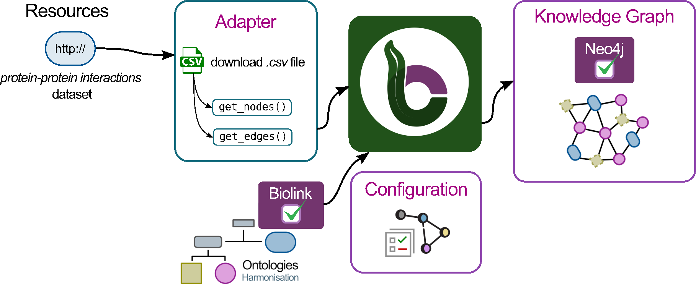

# Title

## Overview

This tutorial will help you get started with BioCypher. You will learn how to integrate different types of biomedical data and create a simple knowledge graph about proteins and their interactions.

By the end of this tutorial, you will be able to:

- Set up BioCypher for a basic project.
- Collect and organize example protein data.
- Build a small knowledge graph from the data.
- View and query the graph using Neo4j.

## Pre-requisites

1. Poetry.
2. Python >= 3.10
3. Git 

## Setup

In this section, you will set up your working environment using the BioCypher Project Template. This template provides a ready-to-use folder structure and example files, so you can focus on building your application.


**Before you start:**
- Ensure you have [Poetry](https://python-poetry.org/docs/#installation) and Python 3.10 or higher installed. If not, follow the official installation guides.

**Steps:**

1. Clone the BioCypher Project Template and rename the folder as `tutorial-basics-biocypher`:
```bash
git clone https://github.com/biocypher/project-template.git
mv project-template tutorial-basics-biocypher
cd tutorial-basics-biocypher
```

2. Initialize your own Git repository:
```bash
rm -rf .git
git init
git add .
git commit -m "Initial commit"
```

3. Install the dependencies using Poetry (or use pip/conda if you prefer; dependencies are listed in `pyproject.toml`):
```bash
poetry install
```


**Tip:** If you encounter issues with Poetry or Python, consult the official documentation or use your system's package manager to install them.

**Check your setup:**
Run the following command to confirm your environment is ready:
```bash
poetry run python --version
```
You should see your Python version (3.10 or higher).

## Section 1. Exploratory Data Analysis

For this tutorial we are going to use a [synthetic dataset](https://zenodo.org/records/16745602) that contains information about the interaction between proteins. First, download the dataset:

```bash
mkdir -p ./data/in/
curl -o ./data/in/synthetic_protein_interactions.tsv https://zenodo.org/records/16745602/files/synthetic_protein_interactions.tsv
```

Now, let's explore the dataset using pandas. Open a Python environment (Jupyter Notebook, VS Code, or a Python script) and run the following code:

```python
import pandas as pd

# Load the dataset
df = pd.read_csv('./data/in/synthetic_protein_interactions.tsv', sep='\t')

# Show the first few rows
display(df.head())

# Get basic info about the dataset
df.info()

# Check for missing values
print(df.isnull().sum())

# Show summary statistics for numeric columns
print(df.describe())

# Show unique protein names (assuming columns are 'protein_a' and 'protein_b')
print('Unique proteins in column protein_a:', df['protein_a'].nunique())
print('Unique proteins in column protein_b:', df['protein_b'].nunique())

```

## Section 2. Graph Modeling
### Graph Modeling

By looking the data we can notice there are two columns called `source` and `target`, they represent proteins. It means each row represent the interaction between a `source` protein and a `target` protein. So for now, our graph could look like this:

<div align="center">
  
</div>

Can we improve the graph? Yes, we could. This is why undestanding the data is crucial to build any graph. If we put attention to the other columns in the table, we can notice the following:

- There are columns `source` and `target`, they can represent **nodes**.

- Each protein in the `source` column has properties such as:
  - `source_genesymbol`
  - `ncbi_tax_id_source`
  - `entity_type_source`

- Each protein in the `target` column has properties such as:
  - `target_genesymbol`
  - `ncbi_tax_id_target`
  - `entity_type_target`

<div align="center">
  
</div>


We know that a `source` protein interacts with a `target` protein, but do we know how? 


The remaining column in the table contain properties about the interaction between proteins. 

Properties interactions
- `is_directed`
- `is_stimulation`
- `is_inhibition`
- `consensus direction`
- `consensus inhibition`
- `type`

We are ready to model our first version of our graph. It is like follows:

<div align="center">
  
</div>

Finally, we can create a more refined graph with the data we have in our dataset. 

<div align="center">
  
</div>

### Exercise 1. Example of a graph we expect with our data

> 📝 **Exercise:** 
> Sketch a  portion of the knowledge graph using the data!

> ✅ **Answer:** 
> Your sketch should look like this in case you use all the nodes and edges in your csv file.


## Section 3. Graph creation with `BioCypher`

We aim to create a knowledge graph using the data we found in the .csv. Let's recap our exercise:

- Create a **graph** with the following characteristics:
  - One node type: `Protein`.
  - Five edge types: `activation`, `binding`, `inhibition`, `phosphorylation`, `ubiquitination`.
- Each **node** has properties:
  - *genesymbol*
  - *ncbi_tax_id*
  - *entity_type*
  
- Each **edge** has properties:
  - *is_directed*
  - *is_stimulation*
  - *is_inhibition*
  - *consensus_direction*
  - *consensus_inhibition*

- We must export the Knowledge Graph to Neo4j.

We can divide the complete process in three sections called:
1. Configuration.
     - Schema configuration.
     - BioCypher configuration 

2. Adapter creation.
     - read/connect to input data.
     - process data.
     - stream processed data.

3. Create a Knowledge Graph script for the entire pipeline.


### Step 1. Configuration

<div align="center">
  
</div>

#### Create a schema for your graph

**Rationale:** the schema file allows us to define the skeleton for our knowledge graph. Nodes, edges, properties are defined here.

**File: `schema_config.yaml`**
```yaml
#-------------------------------------------------------------------
#-------------------------      NODES      -------------------------
#-------------------------------------------------------------------
#=========    PARENT NODES
protein:
    represented_as: node
    preferred_id: uniprot
    input_label: uniprot_protein

#-------------------------------------------------------------------
#------------------      RELATIONSHIPS (EDGES)     -----------------
#-------------------------------------------------------------------
#=========    PARENT EDGES
protein protein interaction:
    is_a: pairwise molecular interaction
    represented_as: edge
    input_label: protein_protein_interaction
    properties:
        is_stimulation: bool
        is_inhibition: bool
        consensus_direction: bool
        consensus_stimulation: boo
        
#=========    INHERITED EDGES
binding:
    is_a: protein protein interaction
    inherit_properties: true
    represented_as: edge
    input_label: binding

# ...rest of schema_config.yaml omitted for brevity...
```

##### Nodes

`protein:` this top-key, in the .yaml snippet, identifies our entity and connects to the ontological backbone.


| key              | value             | description                                                                                                                                                               |
| ---------------- | ----------------- | ------------------------------------------------------------------------------------------------------------------------------------------------------------------------- |
| `represented_as` | `node`            | tells BioCypher in which way each entity should be represented in the graph, in this case as a node.                                                                      |
| `preferred_id`   | `uniprot`         | defines a namespace for our proteins, in our particular case all the proteins follows the uniprot convention (a 5-character string of numbers and letters, ie. P00533)    |
| `input_label`    | `uniprot_protein` | indicates which label to expect in the node tuple and all other input nodes that do not carry this label are ignored as long as they are not in the schema configuration. |

For more information about which other keywords you can use to configure your nodes in the schema file consult [Fields reference](https://biocypher.org/BioCypher/reference/schema-config/#fields-reference).

TODO: [Edwin] explain a little bit about how to express the ontological backbone Biolink model


##### Edges (relationships)

As we saw in the Figure 4. Graph Model with five interactions, each edge has the same field properties (`is_directed`, `is_consensus`, etc.). In this point we have two options to define the edges:

- Option 1: to create each edge and explicitly define the same property fields for each edge.

```yaml
#-------------------------------------------------------------------
#------------------      RELATIONSHIPS (EDGES)     -----------------
#-------------------------------------------------------------------
activation:
    is_a: pairwise molecular interaction
    represented_as: edge
    input_label: protein_protein_interaction
    properties:
        is_stimulation: bool
        is_inhibition: bool
        consensus_direction: bool
        consensus_stimulation: bool

binding:
    is_a: pairwise molecular interaction
    represented_as: edge
    input_label: protein_protein_interaction
    properties:
        is_stimulation: bool
        is_inhibition: bool
        consensus_direction: bool
        consensus_stimulation: bool

# ...rest of schema_config.yaml omitted for brevity...
```

- Option 2: to create a base edge with the properties, then we can create edges that inherit the behavior of this base edge. With this we can save some lines of code and avoid repeatition. Imagine, you have more than 20 edges, option 1 probably is not a good idea for that case.

```yaml
#-------------------------------------------------------------------
#------------------      RELATIONSHIPS (EDGES)     -----------------
#-------------------------------------------------------------------
#====   BASE EDGE or PARENT EDGE
protein protein interaction:
    is_a: pairwise molecular interaction
    represented_as: edge
    input_label: protein_protein_interaction
    properties:
        is_stimulation: bool
        is_inhibition: bool
        consensus_direction: bool
        consensus_stimulation: boo
        
#====   INHERITED EDGES
activation:
    is_a: protein protein interaction
    inherit_properties: true
    represented_as: edge
    input_label: activation

binding:
    is_a: protein protein interaction
    inherit_properties: true
    represented_as: edge
    input_label: binding

# ...rest of schema_config.yaml omitted for brevity...
```

Let's explain the keys and values for the second case (Option 2), because we are going to use the second option approach.

**Base Edge**
`protein protein interaction:` this top-key, in the .yaml snippet, identifies our edge entity.

| key              | value                                             | description                                                                                                    |
| ---------------- | ------------------------------------------------- | -------------------------------------------------------------------------------------------------------------- |
| `is_a`           | `pairwise molecular interaction`                  | defines the type of entity based on the ontology                                                               |
| `represented_as` | `edge`                                            | defines explicitly, this is an edge                                                                            |
| `input_label`    | `protein_protein_interaction`                     | defines a namespace for our relationships                                                                      |
| `properties`     | *property*: *datatype* (i.e. `is_directed: bool`) | this key holds all the properties associated to this edge, each property has a name and a datatype associated. |


**Inherited Edges**
`activation:` this top-key, in the .yaml snippet, identifies our edge entity.

| key                  | value                         | description                                                                                           |
| -------------------- | ----------------------------- | ----------------------------------------------------------------------------------------------------- |
| `is_a`               | `protein protein interaction` | defines the type of entity based, in this case is child of the base edge we defined previosly         |
| `inherit_properties` | `true`                        | defines if we should inherit all the properties defined in the base edge                              |
| `represented_as`     | `edge`                        | BioCypher will treat this entity (`activation`) as an edge.                                           |
| `input_label`        | `binding`                     | specifies the expected edge label; edges without this label are ignored unless defined in the schema. |


> 📝 **Exercise:** 
> Complete the `schema_config.yaml` file and ensure it is in the `config` folder.

> ✅ **Answer:** 
> See the example below for a completed `schema_config.yaml`.

**File: `schema_config.yaml`**
```yaml
#-------------------------------------------------------------------
#-------------------------      NODES      -------------------------
#-------------------------------------------------------------------
#====   PARENT NODES
protein:
    represented_as: node
    preferred_id: uniprot
    input_label: uniprot_protein

#-------------------------------------------------------------------
#------------------      RELATIONSHIPS (EDGES)     -----------------
#-------------------------------------------------------------------
#====   PARENT EDGES
protein protein interaction:
    is_a: pairwise molecular interaction
    represented_as: edge
    input_label: protein_protein_interaction
    properties:
        is_stimulation: bool
        is_inhibition: bool
        consensus_direction: bool
        consensus_stimulation: boo
        
#====   INHERITED EDGES
activation:
    is_a: protein protein interaction
    inherit_properties: true
    represented_as: edge
    input_label: activation

binding:
    is_a: protein protein interaction
    inherit_properties: true
    represented_as: edge
    input_label: binding

inhibition:
    is_a: protein protein interaction
    inherit_properties: true
    represented_as: edge
    input_label: inhibition

phosphorylation:
    is_a: protein protein interaction
    inherit_properties: true
    represented_as: edge
    input_label: phosphorylation

ubiquitination:
    is_a: protein protein interaction
    inherit_properties: true
    represented_as: edge
    input_label: ubiquitination

```

#### Configure `BioCypher` behavior

**Rationale:** The purpose of writing a `biocypher_config.yaml` is to define how BioCypher should operate for your project—specifying settings for data import, graph creation, and database interaction—all in one place for clarity and easy customization.


**File: `biocypher_config.yaml`**
```yaml
#---------------------------------------------------------------
#--------        BIOCYPHER GENERAL CONFIGURATION        --------
#---------------------------------------------------------------
biocypher:
  offline: true
  debug: false
  schema_config_path: config/schema_config.yaml
  cache_directory: .cache

#----------------------------------------------------
#--------        OUTPUT CONFIGURATION        --------
#----------------------------------------------------
neo4j:
  delimiter: '\t'
  array_delimiter: '|'
  skip_duplicate_nodes: true
  skip_bad_relationships: true
  import_call_bin_prefix: /usr/bin/
```


The first block is the BioCypher Core Settings, which starts with `biocypher:`

| key                  | value                       | description                                                          |
| -------------------- | --------------------------- | -------------------------------------------------------------------- |
| `offline`            | `true`                      | Whether to run in offline mode (no running DBMS or in-memory object) |
| `debug`              | `false`                     | Whether to enable debug logging                                      |
| `schema_config_path` | `config/schema_config.yaml` | Path to the schema configuration file                                |
| `cache_directory`    | `.cache`                    | Path to the schema configuration file                                |


The second block is the Database Management System Settings, which starts with the name of the DBMS, in this case it's `neo4j:`

| key                      | value       | description                                          |
| ------------------------ | ----------- | ---------------------------------------------------- |
| `delimiter`              | `'\t'`      | Field delimiter for CSV import files                 |
| `array_delimiter`        | `';'`       | Delimiter for array values                           |
| `skip_duplicate_nodes`   | `true`      | Whether to skip duplicate nodes during import        |
| `skip_bad_relationships` | `true`      | Whether to skip relationships with missing endpoints |
| `import_call_bin_prefix` | `/usr/bin/` | Prefix for the import command binary (optional)      |


The default configuration that comes with BioCypher and more configuration parameters for the Settings are listed in [BioCypher Configuration Reference](https://biocypher.org/BioCypher/reference/biocypher-config/).

> 📝 **Exercise:** 
> Rewrite the content of the `biocypher_config.yaml` file, with the content of the aforementioned snippet.
> Ensure this file is under the `config` folder. 

> ✅ **Answer:** 
> See the example below for a completed `biocypher_config.yaml`.

**File: `biocypher_config.yaml`**
```yaml
#---------------------------------------------------------------
#--------        BIOCYPHER GENERAL CONFIGURATION        --------
#---------------------------------------------------------------
biocypher:
  offline: true
  debug: false
  schema_config_path: config/schema_config.yaml
  cache_directory: .cache

#----------------------------------------------------
#--------        OUTPUT CONFIGURATION        --------
#----------------------------------------------------
neo4j:
  delimiter: '\t'
  array_delimiter: '|'
  skip_duplicate_nodes: true
  skip_bad_relationships: true
  import_call_bin_prefix: /usr/bin/
```

### Step 2. Create an adapter

<div align="center">
  
</div>

**Rationale:** An adapter allows you to efficiently transform, integrate, combine data from different sources ensuring compatibility with BioCypher's schema and streamlining the import process.

**File: `adapter_synthetic_proteins.py`**
```python
import os
from enum import Enum, auto
from itertools import chain
from typing import Optional, Generator
from pathlib import Path


import pandas as pd
from biocypher import BioCypher
from biocypher._logger import logger


CSV_FILE_PATH_SYNTHETIC_PROTEINS = Path("./synthetic_protein_interactions.tsv")

class AdapterNodeType(Enum):
    """
    Define types of nodes the adapter can provide.
    """

    PROTEIN = auto()

class AdapterProteinField(Enum):
    """
    Define possible fields the adapter can provide for proteins.
    """

    ID = "id"
    PREFERRED_ID = "preferred_id"
    GENE_SYMBOL = "genesymbol"
    NCBI_TAX_ID = "ncbi_tax_id"

class AdapterEdgeType(Enum):
    """
    Enum for the types of the protein adapter.
    """

    PROTEIN_PROTEIN_INTERACTION = "protein_protein_interaction"
    BINDING = "binding"
    ACTIVATION = "activation"
    PHOSPHORYLATION = "phosphorylation"
    UBIQUITINATION = "ubiquitination"
    INHIBITION = "inhibition"

class AdapterProteinProteinEdgeField(Enum):
    """
    Define possible fields the adapter can provide for protein-protein edges.
    """

    INTERACTION_TYPE = "interaction_type"
    INTERACTION_SOURCE = "interaction_source"
    IS_STIMULATION = "is_stimulation"
    IS_INHIBITION = "is_inhibition"
    CONSENSUS_DIRECTION = "consensus_direction"
    CONSENSUS_STIMULATION = "consensus_stimulation"
    CONSENSUS_INHIBITION = "consensus_inhibition"

class Adapter:
    def __init__(
        self,
        csv_path: str = CSV_FILE_PATH_SYNTHETIC_PROTEINS,
        node_types: Optional[list] = None,
        node_fields: Optional[list] = None,
        edge_types: Optional[list] = None,
        edge_fields: Optional[list] = None,
    ):
        self.csv_path = csv_path
        self._set_types_and_fields(node_types, node_fields, edge_types, edge_fields)

    def _read_csv(self) -> pd.DataFrame:
        """
        Reads and validates the TSV file.
        Returns:
            pd.DataFrame: DataFrame containing the TSV data.
        Raises:
            FileNotFoundError: If the file does not exist.
            ValueError: If required columns are missing.
        """
        if not Path(self.csv_path).exists():
            logger.error(f"CSV file not found: {self.csv_path}")
            raise FileNotFoundError(f"CSV file not found: {self.csv_path}")
        df = pd.read_csv(self.csv_path, sep="\t", header=0)
        required_columns = [
            'source', 'target', 'source_genesymbol', 'target_genesymbol',
            'ncbi_tax_id_source', 'ncbi_tax_id_target', 'type',
            'is_stimulation', 'is_inhibition', 'consensus_direction',
            'consensus_stimulation', 'consensus_inhibition'
        ]
        missing = [col for col in required_columns if col not in df.columns]
        if missing:
            logger.error(f"Missing columns in CSV: {missing}")
            raise ValueError(f"CSV must contain columns: {missing}")
        return df

    def get_nodes(self) -> 'Generator[tuple[str, str, dict], None, None]':
        """
        Yields node tuples for node types specified in the adapter constructor.

        Returns:
            Generator[tuple[str, str, dict], None, None]:
                Each tuple is (id, label, properties).
        """
        logger.info("Reading nodes.")
        df = self._read_csv()

        # Generator for nodes in the `source` column
        for row in df.itertuples(index=False):            
            id = row.source
            input_label = "uniprot_protein"

            properties = {
                'genesymbol': row.source_genesymbol,
                'ncbi_tax_id': row.ncbi_tax_id_source,
                'entity_type': row.entity_type_source,
            }

            yield(
                id,
                input_label,
                properties
            )

        # Generator for nodes in the `target` column
        for row in df.itertuples(index=False):            
            id = row.target
            input_label = "uniprot_protein"

            properties = {
                'genesymbol': row.target_genesymbol,
                'ncbi_tax_id': row.ncbi_tax_id_target,
                'entity_type': row.entity_type_target,
            }

            yield(
                id,
                input_label,
                properties
            )

    def get_edges(self) -> 'Generator[tuple[str, str, str, str, dict], None, None]':
        """
        Yields edge tuples for edge types specified in the adapter constructor.

        Returns:
            Generator[tuple[str, str, str, str, dict], None, None]:
                Each tuple is (id, source, target, type, properties).
        """
        logger.info("Generating edges.")
        df = self._read_csv()

        for row in df.itertuples(index=False):
            # Concatenate source and target, i.e., "SOD1EGFR"
            id = f"{row.source}{row.target}"

            source = row.source
            
            target = row.target

            type = row.type

            properties = {
                'is_stimulation': row.is_stimulation,
                'is_inhibition': row.is_inhibition,
                'consensus_direction': row.consensus_direction,
                'consensus_stimulation': row.consensus_stimulation,
                'consensus_inhibition': row.consensus_inhibition
            }

            yield (
                id,
                source,
                target,
                type,
                properties
            )

    def get_node_count(self) -> int:
        """
        Returns the number of nodes generated by the adapter.

        Returns:
            int: Number of nodes generated.
        """
        return sum(1 for _ in self.get_nodes())

    def _set_types_and_fields(self, node_types, node_fields, edge_types, edge_fields) -> None:
        """
        Sets the node and edge types and fields for the adapter.

        Args:
            node_types (Optional[list]): List of node types.
            node_fields (Optional[list]): List of node fields.
            edge_types (Optional[list]): List of edge types.
            edge_fields (Optional[list]): List of edge fields.
        """
        if node_types:
            self.node_types = node_types
        else:
            self.node_types = [type for type in AdapterNodeType]

        if node_fields:
            self.node_fields = node_fields
        else:
            self.node_fields = [
                field
                for field in chain(
                    AdapterProteinField,
                )
            ]

        if edge_types:
            self.edge_types = edge_types
        else:
            self.edge_types = [type for type in AdapterEdgeType]

        if edge_fields:
            self.edge_fields = edge_fields
        else:
            self.edge_fields = [field for field in chain()]
```


### Step 3. Create a knowledge graph script

<div align="center">
  
</div>

TODO: add rationale


1. Create a BioCypher object
  **File: `create_knowledge_graph.py`**
    ```python
    import BioCypher

    # Create an instance of BioCypher
    bc = BioCypher()
    ```

2. Instantiate your adapter

    **File: `create_knowledge_graph.py`**
    ```python

    # Choose the node type you want appear in the Knowledge Graph
    node_types = [
        AdapterNodeType.PROTEIN
    ]

    # Choose protein adapter fields to include in the knowledge graph.
    node_fields = [
        AdapterProteinField.ID,
        AdapterProteinField.PREFERRED_ID,
        AdapterProteinField.GENESYMBOL,
        AdapterProteinField.NCBI_TAX_ID
    ]

    # Choose the node type you want appear in the Knowledge Graph
    edge_types = [
        AdapterEdgeType.PROTEIN_PROTEIN_INTERACTION,
        AdapterEdgeType.BINDING,
        AdapterEdgeType.ACTIVATION,
        AdapterEdgeType.PHOSPHORYLATION,
        AdapterEdgeType.UBIQUITINATION,
        AdapterEdgeType.INHIBITION
    ]

    # (there is not code here!) Choose interaction adapter fields to include in the knowledge graph.
    # By default, in case of not specifying this, BioCypher will bring all the fields defined in the adapter

    # Create an adapter instance
    adapter = Adapter(
        node_types=node_types,
        node_fields=node_fields,
        edge_types=edge_types,
    )
    ```

3. Write data from your adapter to BioCypher
    **File: `create_knowledge_graph.py`**
    ```python
    # Create a knowledge graph from the adapter
    bc.write_nodes(adapter.get_nodes())
    bc.write_edges(adapter.get_edges())
    ```

4. Export your graph to Neo4j (generation of .csvs and import script)
    **File: `create_knowledge_graph.py`**
    ```python
    # Generate assets for Neo4j exportation
    bc.write_import_call()
    ```

5. Print summary
    **File: `create_knowledge_graph.py`**
    ```python
    # Print a summary when
    bc.summary()
    ```

> 📝 **Exercise:** 
> Integrate the aforementioned snippets in a single file called `create_knowledge_graph.py` script and run it!

> ✅ **Answer:** 
> See the example below for a completed `create_knowledge_graph.yaml`.

**File: `create_knowledge_graph.py`**

```python
import BioCypher

# Create an instance of BioCypher
bc = BioCypher()

# Choose the node type you want appear in the Knowledge Graph
node_types = [
    AdapterNodeType.PROTEIN
]

# Choose protein adapter fields to include in the knowledge graph.
node_fields = [
    AdapterProteinField.ID,
    AdapterProteinField.PREFERRED_ID,
    AdapterProteinField.GENESYMBOL,
    AdapterProteinField.NCBI_TAX_ID
]

# Choose the node type you want appear in the Knowledge Graph
edge_types = [
    AdapterEdgeType.PROTEIN_PROTEIN_INTERACTION,
    AdapterEdgeType.BINDING,
    AdapterEdgeType.ACTIVATION,
    AdapterEdgeType.PHOSPHORYLATION,
    AdapterEdgeType.UBIQUITINATION,
    AdapterEdgeType.INHIBITION
]

# (there is not code here!) Choose interaction adapter fields to include in the knowledge graph.
# By default, in case of not specifying this, BioCypher will bring all the fields defined in the adapter

# Create an adapter instance
adapter = Adapter(
    node_types=node_types,
    node_fields=node_fields,
    edge_types=edge_types,
)

# Create a knowledge graph from the adapter
bc.write_nodes(adapter.get_nodes())
bc.write_edges(adapter.get_edges())

# Generate assets for Neo4j exportation
bc.write_import_call()

# Print a summary when
bc.summary()
```

## Section 4. Interacting with your graph using Neo4j
### Load the graph using an import script
### Visualize the graph
### Execute cypher queries

