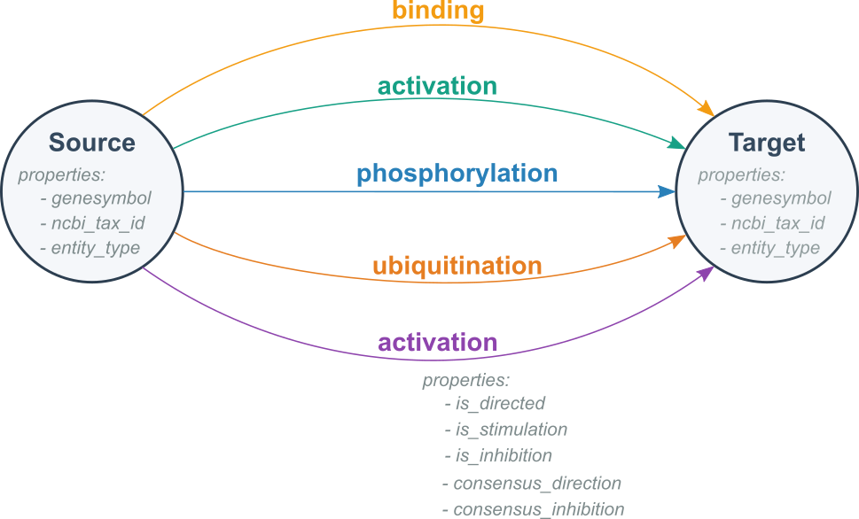

# Title

## Overview

This tutorial will help you get started with BioCypher. You will learn how to bring together different types of biomedical data and create a simple knowledge graph about proteins and their connections.

By the end of this tutorial, you will be able to:

- Set up BioCypher for a basic project.
- Collect and organize example protein data.
- Build a small knowledge graph from the data.
- View and search the graph using Neo4j.

## Pre-requisites

1. Poetry.
2. Python >= 3.10

## Setup

In this section, you will set up your working environment using the BioCypher Project Template. This template provides a ready-to-use folder structure and example files, so you can focus on building your application.

**Before you start:**
- Make sure you have [Poetry](https://python-poetry.org/docs/#installation) and Python 3.10 or higher installed. If not, follow the official installation guides.

**Steps:**

1. Clone the BioCypher Project Template and rename the folder as `tutorial-basics-biocypher`:
```bash
git clone https://github.com/biocypher/project-template.git
mv project-template tutorial-basics-biocypher
cd tutorial-basics-biocypher
```

2. Initialize your own Git repository:
```bash
rm -rf .git
git init
git add .
git commit -m "Initial commit"
```

3. Install the dependencies using Poetry (or use pip/conda if you prefer; dependencies are listed in `pyproject.toml`):
```bash
poetry install
```


**Tip:** If you have trouble with Poetry or Python, check the official documentation or use your system's package manager to install them.

**Check your setup:**
Run the following command to confirm your environment is ready:
```bash
poetry run python --version
```
You should see your Python version (3.10 or higher).

## Section 1. Exploratory Data Analysis

For this tutorial we are going to use a [synthetic dataset](https://zenodo.org/records/16745602) that contains information about the interaction between proteins. First, download the dataset:

```bash
mkdir -p ./data/in/
curl -o ./data/in/synthetic_protein_interactions.tsv https://zenodo.org/records/16745602/files/synthetic_protein_interactions.tsv
```

Now, let's explore the dataset using pandas. Open a Python environment (Jupyter Notebook, VS Code, or a Python script) and run the following code:

```python
import pandas as pd

# Load the dataset
df = pd.read_csv('./data/in/synthetic_protein_interactions.tsv', sep='\t')

# Show the first few rows
display(df.head())

# Get basic info about the dataset
df.info()

# Check for missing values
print(df.isnull().sum())

# Show summary statistics for numeric columns
print(df.describe())

# Show unique protein names (assuming columns are 'protein_a' and 'protein_b')
print('Unique proteins in column protein_a:', df['protein_a'].nunique())
print('Unique proteins in column protein_b:', df['protein_b'].nunique())

```

Important


TODO: [Edwin] provide a link to the data possible in Zenodo?

## Section 2. Graph Modeling
### Graph Modeling
TODO: [Edwin] add a example about the final graph

By looking the data we can notice there are two columns called `source` and `target`, they represent proteins. It means each row represent the interaction between a `source` protein and a `target` protein. So for now, our graph could look like this:

<div align="center">
  
</div>

Can we improve the graph? Yes, we could. This is why undestanding the data is crucial to build any graph. If we put attention to the other columns in the table, we can notice the following:

- There are columns `source` and `target`, they can represent **nodes**.

- Each protein in the `source` column has properties such as:
  - `source_genesymbol`
  - `ncbi_tax_id_source`
  - `entity_type_source`

- Each protein in the `target` column has properties such as:
  - `target_genesymbol`
  - `ncbi_tax_id_target`
  - `entity_type_target`

<div align="center">
  
</div>


We know that a `source` protein interacts with a `target` protein, but do we know how? 


The remaining column in the table contain properties about the interaction between proteins. 

Properties interactions
- `is_directed`
- `is_stimulation`
- `is_inhibition`
- `consensus direction`
- `consensus inhibition`
- `type`

We are ready to model our first version of our graph. It is like follows:

<div align="center">
  
</div>

Finally, we can create a more refined graph with the data we have in our dataset. 

<div align="center">
  
</div>

### Exercise 1. Example of a graph we expect with our data


## Section 3. Graph creation with `BioCypher`

#### Step 1. Configuration

##### Configure `BioCypher` behavior
TODO: [Shuangshuang] explain a little bit how we are going to configure BioCypher for this example:
BioCypher includes a default set of configuration parameters, which you can overwrite them by creating a `biocypher_config.yaml` file in the root directory or the `config` directory of your project. You only need to specify the ones you wish to override from default. 
Now we use the following `biocypher_config.yaml` as an example:
```yaml
biocypher:
  offline: true
  debug: false
  schema_config_path: config/schema_config.yaml
  cache_directory: .cache

neo4j:
  delimiter: '\t'
  array_delimiter: "|"
  skip_duplicate_nodes: true
  skip_bad_relationships: true
  import_call_bin_prefix: /usr/bin/
```
The first block is the BioCypher Core Settings, which starts with `biocypher:`

```yaml
  offline: true
```
Whether to run in offline mode (no running DBMS or in-memory object)
```yaml
  debug: false
```
Whether to enable debug logging
```yaml
  schema_config_path: config/schema_config.yaml
```
Path to the schema configuration file
```yaml
  cache_directory: .cache
```
Directory for cache files

The second block is the Database Management System Settings, which starts with the name of the DBMS, in this case it's `neo4j:`

```yaml
  delimiter: '\t'
```
Field delimiter for CSV import files
```yaml
  array_delimiter: "|"
```
Delimiter for array values
```yaml
  skip_duplicate_nodes: true
```
Whether to skip duplicate nodes during import
```yaml
  skip_bad_relationships: true
```
Whether to skip relationships with missing endpoints
```yaml
  import_call_bin_prefix: /usr/bin/
```
Prefix for the import command binary (optional)

The default configuration that comes with BioCypher and more configuration parameters for the Settings are listed in [BioCypher Configuration Reference](https://biocypher.org/BioCypher/reference/biocypher-config/)


##### Create a schema for your graph
TODO: [Shuangshuang] explain a little bit how to produce this schema based on data and modeling section
```yaml
protein:
    represented_as: node
    preferred_id: uniprot
    input_label: uniprot_protein

protein protein interaction:
    is_a: pairwise molecular interaction
    represented_as: edge
    input_label: protein_protein_interaction
    properties:
        is_stimulation: bool
        is_inhibition: bool
        consensus_direction: bool
        consensus_stimulation: bool
        consensus_inhibition: bool

binding:
    is_a: protein protein interaction
    inherit_properties: true
    represented_as: edge
    input_label: binding
```
TODO: [Edwin] explain a little bit about how to express the ontological backbone Biolink model

The first block is the node settings. In this case, it starts with `protein:` since we import proteins.

```yaml
    represented_as: node
```
The `represented_as` key tells BioCypher in which way each entity should be represented in the graph, it's either `node` or `edge`

```yaml
    preferred_id: uniprot
```
TODO: [Edwin] explain a little bit about `preferred_id` key
```yaml
    input_label: uniprot_protein
```
The adapter reads the input data stream and output the node tuples with format `[id,label,properties]` for BioCypher to take care. ID and label are mandatory while properties are optional. In this case, we didn't configure the properties for node. `input_label` key indicates which `label` to expect in the node tuple and all other input nodes that do not carry this label are ignored as long as they are not in the schema configuration.

The second block is the relationship settings. In this case, it starts with `protein protein interaction:` since we import protein interactions in this case.

```yaml
    is_a: pairwise molecular interaction

```
the `is_a` key is used to define inheritance
```yaml
    represented_as: edge
```
here the `represented_as` is `edge` because this block configures the relationship.
```yaml
    input_label: protein_protein_interaction
```
The adapter reads the input data stream and output the edge tuples with format `[id,source_id,target_id,edge_label,properties]` for BioCypher to take care. IDs and label are mandatory while properties are optional.`input_label` key indicates which `edge_label` to expect in the edge tuple and all other input edges that do not carry this label are ignored as long as they are not in the schema configuration.

```yaml
    properties:
        is_stimulation: bool
        is_inhibition: bool
        consensus_direction: bool
        consensus_stimulation: bool
        consensus_inhibition: bool
```
properties are optional and can include different types of information on the entities.

The third block is a child relationship inherits from `protein protein interaction`. Sometimes, explicit designation of properties requires a lot of maintenance work, particularly for classes with many properties. In these cases, it may be more convenient to inherit properties from a parent class. 
```yaml
    is_a: protein protein interaction
    inherit_properties: true
```
This is done by defining inheritance via the `is_a` key in the child class configuration and setting the `inherit_properties` key to `true`.
```yaml
    represented_as: edge
```
here the `represented_as` is `edge` because this block configures the relationship.
```yaml
    input_label: binding
```
In this case, all other input edges that do not carry this `binding` label are ignored as long as they are not in the schema configuration.


#### Step 2. Create an adapter
BioCypher is like a toolkit that helps users combine and use information from different biomedical sources without repeating the same work. Instead of everyone building their own custom solutions from scratch, BioCypher provides ready-made “adapters” that can connect to different databases and ontologies. You can also build your own adapter.


#### Step 4. Create a knowledge graph script

- Create a BioCypher object


- Instantiate your adapter


- Write data from your adapter to BioCypher
  
### Section 4. Interacting with your graph using Neo4j
#### Load the graph using an import script
#### Visualize the graph
#### Execute cypher queries

